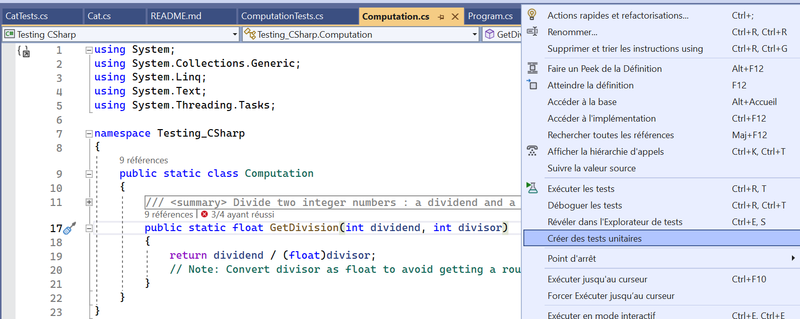

# Testing CSharp

**Objective** => learn how to generate, manage and work with unit test in C#.

More informations about Tests [here](https://github.com/VictorMauroy/Testing-Lesson).
*(Note: This is an ongoing documentation link)*

<details>
<summary> Caution (fork) </summary>
The Current project will not build correctly.
<br>
To be able to add my unit test on Github, 
I had to move the folder corresponding to my Project "Testing CSharpTests" into the folder of "Testing CSharp". 
Otherwise, github couldn't see the files because they aren't in the target repository.
<br> <br>
You should remove the folder "Testing CSharpTests" and generate new Unit Test in order for the project to build and run tests.
</details>


## 1) Start a .NET console project.
### Linux
Download and install **Visual Studio Code**. <br>
Download and install **Dotnet** (Include SDK & Runtime): 
```bash
sudo apt-get update && \
  sudo apt-get install -y dotnet-sdk-7.0
```

Recommanded extensions:
* C# *Extension* (Nugget, Test, Build/Run, Add project, etc.)
* *IntelliCode* (Autocomplete and suggestions)
* C# *Dev Kit* (Include intelliCode and C# Extension)

Create a .NET console project:
```bash 
dotnet new console -o <MyProject>
```
### Windows
Download and install [Dotnet](https://dotnet.microsoft.com/en-us/download) (Include SDK & Runtime).

Download and install [Visual Studio Community](https://visualstudio.microsoft.com/fr/free-developer-offers/).
<br> You can also install Enterprise or Professionnal (Paid version).

Create a console project:
1. Open Visual Studio
1. New Project
1. Select "Console Application"
1. Customize your project and create it


## 2) Create functions or methods
In order to perform test, you'll need to create a few functions or a class with methods.

Let's create a static class which can be called without defining an object, and another which is a public class with properties and methods.

### Static class
A **static** class is a special type of class which doesn't need to define an object to access the methods.
```csharp
public static class Computation
{
    public static float GetDivision(int dividend, int divisor)
    {
        return dividend / (float)divisor;
        // Note: Convert divisor as float to avoid getting a rounded integer
    }
}
```
For that specific class, you can call the methods by doing so:
```csharp
float quotient = Computation.GetDivision(19, 13);
```
*Note: do not forget to import it with a "using" statement.
You can also use a namespace.*

### Public class with properties and methods
By defining a class as **public**, you make it accessible from outside the script.

Here is an example:
```csharp
public class Cat
{
    public string Name { get; set; }
    public float Weigth { get; set; }

    // Constructor for the Cat class.
    public Cat(string name, float weigth) 
    {
        Name = name;
        Weigth = weigth;
    }
        
    public float RaiseWeigth(float weigthToAdd)
    {
        Weigth+= weigthToAdd;
        return Weigth;
    }
}
```
We defined a class to create Cat objects. 
Our cats can get a customized name and weigth.
<br> 
There is also a method to increase its weigth that we are going to use for our tests.

You can define a new cat by doing so:
```csharp
string myCatName = "Kitty";
float myCatWeigth = 1.5f;

Cat kitty = new Cat(
    myCatName,
    myCatWeigth
);

kitty.RaiseWeigth(0.5f); //This is how to use the RaiseWeigth method.
```


## 3) Generate unit tests

First of all, I recommend you to check that link: [Best practices for Test in C#](https://learn.microsoft.com/en-us/dotnet/core/testing/unit-testing-best-practices).

Then, let's see how to create test for our two type of classes.

### Generation
With Visual Studio (Community, Professionnal and Enterprise), 
there is an incredible option to **generate unit test** (which use MSTest, the default Microsoft Studio Test).

Do to that, move to the files which contain your class or function 
and right click (anywhere inside your class or function) and 
click on "**Create unit tests**".


That will open a new window where you can **configure the generation process**.
<br> For instance: the names of the project. Or if you already have a test project,
you can generate the methods inside the same script.

Work complete! 
No, the next step is to **customize and fill your newly generated methods**.

### Manually create a test project
If you don't want to generate unit tests or if you want to select a different Test Runner, 
here is the procedure to follow:
1. Inside the **Solution Explorer**, right click on the solution. Then **Add** => **New project**.
2. A new window open. You need to select a project type. Click on **all project types** and select **Test**.
3. Previously, we generated a **MSTest test project** with the C# tag. You can also select an **xUnit** or an **nUnit** project.
4. Define classes and methods.

*Note: the rest of the tutorial uses an MSTest test project.*


-------------------------- 

***WORK IN PROGRESS***

--------------------------


### Tests on static class
The following script shows how to write a test that works with a `static class`.
```csharp
using Microsoft.VisualStudio.TestTools.UnitTesting;
using Testing_CSharp; //remember to import your classes

[TestClass()]
public class ComputationTests
{
    [TestMethod()]
    public void GetDivisionTest1()
    {
        // Act
        float test1 = Computation.GetDivision(2, 1);

        // Assert
        Assert.AreEqual(2, test1);
    }
}
```
To obtain an effective test, you need to call the desired function and 
then use the Assert.AreEqual method.
<br>
In that example, the Assert.AreEqual(value1, value2) checks whether both values are equals, 
if yes then the test is a success.

*Note: You can use other Assert methods, depending of the output of your method and the objective of your test.*

### Tests on public class / object class
The following script shows how to write a test that works with a `public class` that uses properties and methods.
```csharp
using Microsoft.VisualStudio.TestTools.UnitTesting;
using Testing_CSharp;

[TestClass()]
public class CatTests
{
    [TestMethod()]
    public void RaiseWeigth_ReturnIncreasedWeigth()
    {
        // Arrange
        float weigth = 3f;
        float weigthDiff = 1f;
        float weigthIncreased = 4f;

        Cat catTest = new Cat("Grominet", weigth);

        // Act
        catTest.RaiseWeigth(weigthDiff);

        // Assert
        Assert.AreEqual(weigthIncreased, catTest.Weigth);
    }
}
```
Thanks to the attributes `[TestClass()]` and `[TestMethod()]`,
Visual Studio can determine that the class and the defined methods are used to run tests.

To make a valid test, we need to **define an object** with its constructor.
In this case `Cat test = new Cat(...);`.
<br>
Then, we **called the method** to test `RaiseWeigth` throught our object.
<br>
Finally, we **check if the result of the test correspond to the expected value**
by calling `Assert.AreEqual(expectedValue, catWeigthValue)`.

If both values are equal, the test is a success, otherwise it will indicate that there is a difference
between the expected value and the result.

### Launch tests


## 4) Automatic unit test
Unit test on build: 
Open the **Test** window > **Test Explorer** > **Options** > **Execute after build**.

Unit test when writing code: https://www.ncrunch.net/

